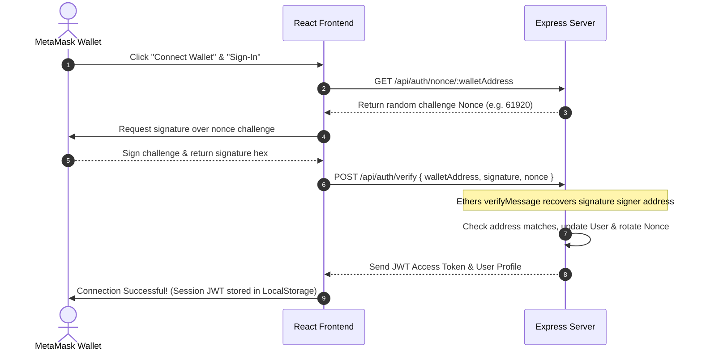

# 🎨 NFT Gallery - Premium Multi-Chain Web3 Portfolio Showcase & Analytics

NFT Gallery is a premium, web-based portfolio application designed to showcase, filter, and track digital collectibles (NFTs) across multiple EVM networks (Ethereum, Polygon, Base, and BNB Chain). Built using a React-Vite frontend, an Express-Node backend, and MongoDB Atlas, it integrates cryptographically secure passwordless wallet sign-ins and leverages optimized Alchemy NFT API v3 connections to deliver a seamless portfolio management experience.

---

## ✨ Features

- **🦊 MetaMask Wallet Integration:** Seamless connection and disconnection controls. Reactive event listeners automatically synchronize changes to the active wallet address or network chain ID.
- **🔐 Cryptographic Sign-In:** Passwordless authentication. The frontend signs a server-issued challenge nonce using MetaMask, which is verified on the backend via Ethers.js to issue a secure JWT session token.
- **🌐 Multi-Chain Aggregation:** Fetches and compiles owned NFTs across Ethereum, Polygon, Base, and BNB Chain in parallel using optimized multi-chain queries.
- **🖼️ OpenSea Image Recovery Fallback:** Automatically resolves missing NFT images caused by IPFS gateway timeouts by pulling cached OpenSea images (`contract.openSeaMetadata.imageUrl`).
- **📈 Real Floor Prices:** Displays authentic floor values mapped directly from network statistics (e.g. `0.0000499 ETH` for Sleepy Emmy OE) and shows `N/A` for assets with no active floor price.
- **🔍 Advanced Filter Sidebar:** Instant layout sorting (Name, ID), custom search, and a responsive filter sidebar. The sidebar utilizes `shrink-0` classes to prevent button collapsing and fits perfectly alongside the responsive card grid.
- **💖 Cloud Favorites Integration:** Authenticated users can save, fetch, and delete custom favorites directly to a cloud-hosted MongoDB Atlas database.
- **📊 Portfolio Dashboard & Analytics:** Monitor visitor metrics, unique collections count, favorites count, and trace system activity telemetry logs.
- **🎨 Glassmorphic Dark/Light Theme:** Curated color palettes with a global dark mode toggle, custom scrollbars, and modern typography (Outfit & Inter) configured for a premium aesthetic.

---

## 🛠️ Tech Stack & Architecture

- **Backend:** Node.js, Express.js, JWT Session Authentication, Ethers.js v6, Mongoose ODM
- **Database:** MongoDB Atlas (Mongoose collections setup)
- **Frontend:** React (Vite compiler), React Router DOM v6, Tailwind CSS v3, Ethers.js v6, React Hot Toast
- **Integrations:** Alchemy NFT API v3 (Ethereum, Polygon, Base, BNB Chain)

---

## 📦 Prerequisites

1. **Node.js** (v20+)
2. **MongoDB Atlas** account (or a local MongoDB instance running on port `27017`)
3. **MetaMask** browser extension installed
4. **Alchemy API Key** (configured for Ethereum, Polygon, Base, and BNB Chain)

---

## 🚀 Installation & Local Setup

### Step 1: Clone & Install Dependencies
1. Extract the project folder.
2. In the root directory (frontend), run:
   ```bash
   npm install
   ```
3. Navigate to the `server/` directory and run:
   ```bash
   cd server
   npm install
   ```

### Step 2: Configure Environment Variables
1. **Frontend Configuration:** Create a `.env` file in the root directory:
   ```env
   VITE_API_URL=http://localhost:5000/api
   ```
2. **Backend Configuration:** Create a `.env` file in the `server/` directory:
   ```env
   PORT=5000
   MONGO_URI=your_mongodb_connection_string
   JWT_SECRET=your_jwt_signing_secret
   ALCHEMY_API_KEY=your_alchemy_api_key
   NODE_ENV=development
   ```

### Step 3: Run the Application Locally
1. **Start Backend Server:** In the `server/` directory, run:
   ```bash
   npm run dev
   ```
2. **Start Frontend Client:** In the root directory, open a new terminal tab and run:
   ```bash
   npm run dev
   ```
3. Open the localhost address printed by Vite (typically `http://localhost:5173`) in your browser.

---

## 🔐 Cryptographic Authentication Flow

The application utilizes a secure signature verification sequence for passwordless sign-ins:



---

## 📡 REST API Reference

All routes are prefixed with `/api`.

| Method | Endpoint | Description | Authentication |
| :--- | :--- | :--- | :--- |
| **GET** | `/auth/nonce/:walletAddress` | Fetch signature challenge nonce | Public |
| **POST** | `/auth/verify` | Verify signed message and issue JWT token | Public |
| **GET** | `/nfts/:walletAddress` | Fetch, search, filter, and paginate user NFTs | Public |
| **GET** | `/user/:walletAddress` | Fetch user profile and stats | Public |
| **PUT** | `/user/profile` | Update username or avatar preferences | JWT Required |
| **GET** | `/favorites/:walletAddress` | Get all saved favorites for a user | Public |
| **POST** | `/favorites` | Add an NFT to favorites database | JWT Required |
| **DELETE** | `/favorites/:id` | Remove NFT from favorites by composite or Mongo ID | JWT Required |
| **GET** | `/analytics` | Get aggregated website and system metrics | Public |

---

## 📂 Directory Structure

```text
NFT_Gallery/
├── src/
│   ├── main.jsx             # React entry point & Provider wrapper
│   ├── App.jsx              # Client-side router configuration
│   ├── index.css            # Custom scrollbars, glassmorphism layers, fonts
│   ├── pages/               # Views (Home, Dashboard, Gallery, NftDetails, Favorites, Profile, Settings)
│   ├── components/          # Reusable components (Navbar, FilterSidebar, NftCard, NftGrid, SearchBar)
│   ├── context/             # React state context (Web3Context, AuthContext, ThemeContext)
│   └── services/            # Axios API client interceptor configuration
├── server/
│   ├── config/db.js         # Mongoose connection bootstrapper
│   ├── models/              # Schema definitions (User, Favorite, Analytics)
│   ├── middleware/          # Security middlewares (JWT verification, errorHandlers)
│   ├── controllers/         # Endpoint logic (authController, nftController, favoriteController)
│   ├── routes/              # Express Router mappings (authRoutes, nftRoutes, favoriteRoutes)
│   └── server.js            # Main server entry & middleware settings
├── package.json             # Frontend packages definition
├── tailwind.config.js       # Tailwind configuration file
└── README.md                # Project documentation
```

---

## 🤝 Contributing

Contributions, issues, and feature requests are welcome! Feel free to check the [issues page](https://github.com/Sonff/NFT_GALLERY/issues).

---

## 📄 License

This project is licensed under the MIT License. See the `LICENSE` file for details.